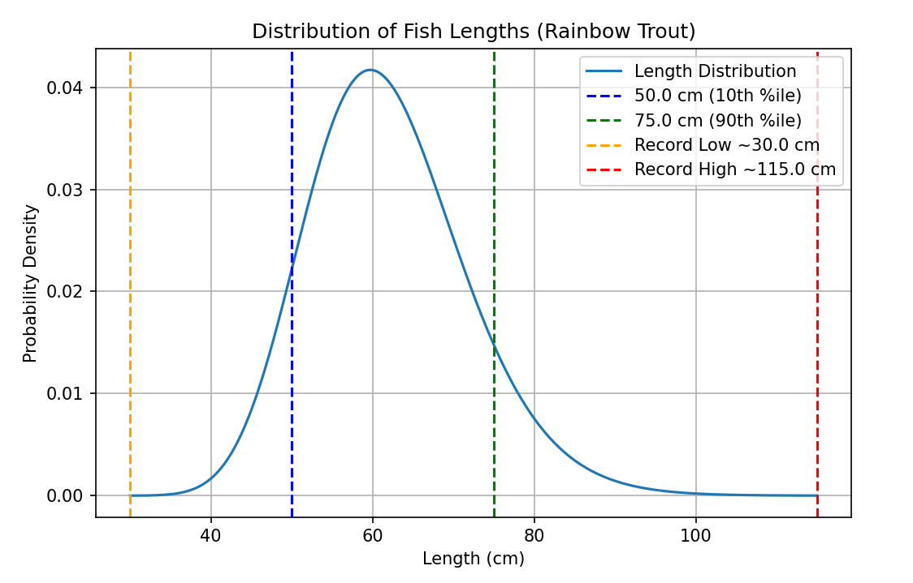

# Fish Data

Each fish present in the loot tables or fishing journal has a corresponding **fish data** JSON file. These files are placed in `data/[namespace]/fishing/fish`. It's recommended that you name each fish data file after the item ID of the fish and place it in a folder that corresponds to its category (ex. data for `tide:rainbow_trout` would be defined in `data/tide/fishing/fish/freshwater/rainbow_trout.json`) although both are optional.

To view examples, you can look at Tide's [built-in fish data files](https://github.com/Lightning-64/Tide-2/tree/main/src/generated-1.21.1/resources/data/tide/fishing/fish) or the [Tide Extra Compatibility](https://modrinth.com/datapack/tide-extra-compatibility) datapack.

Each fish data file has the following properties that can be defined, with almost all of them being optional.

---
## `fish`

The internal item ID of the fish that the JSON file corresponds to. If you're following the recommended conventions, it should be the same item ID in the file name.

If the specified item ID is invalid (either because its corresponding mod is not present or because it wasn't typed correctly) the file will be skipped during the loading process.

!!! warning
    This property is required in all fish data files!

> rainbow_trout.json
> ```json
> {
>     "fish": "tide:rainbow_trout"
> }
> ```

---
## `bucket`
The internal item ID of the bucket item for the fish. This is used for Tide's inventory bucketing mechanic for newly caught fish.

> rainbow_trout.json
> ```json
> {
>     "bucket": "tide:rainbow_trout_bucket"
> }
> ```

---
## `selection_weight`
A numerical value representing the base chance of catching this fish, excluding conditions or modifiers. Each fish that has a nonzero selection weight in a certain area will have their rarities "weighed" against each other to determine which is selected. This property will default to a value of 0 if not defined, making the fish uncatchable.

To understand how this property works, let's imagine the following two fish:

> red_fish.json
> ```json
> {
>     "fish": "example:red_fish",
>     "selection_weight": 30.0
> }
> ```

> blue_fish.json
> ```json
> {
>     "fish": "example:blue_fish",
>     "selection_weight": 10.0
> }
> ```

To determine the percent chance of catching a blue fish, you can take the total selection weights of all fish in the area and add them up. This brings us to a total of 40. Dividing a fish's selection weight by the total weight will give us its probability, so for the blue fish it would be `10 / 40`, or 25%.

However, it's not that simple: the probability of catching a fish changes depending on what fish are around. Let's say we move into a new area where an additional fish can be found:

> green_fish.json
> ```json
> {
>     "fish": "example:green_fish",
>     "selection_weight": 60.0
> }
> ```

The selection weight of the green fish is much higher than that of the other two, and will heavily skew the total selection weight in the area (`60 + 30 + 10`, giving us a total weight of 100). In this new area, the selection weight of the blue fish is only 10%. The blue fish is a whole 2.5x rarer in this environment! When adding fish of your own, make sure to consider the selection weights of neighboring fish to get a true estimate of your fish's rarity.

Luckily, you don't have to do any tedious calculations yourself. Running the command `/fishing test fish` after casting a fishing rod will give you a list of all the catchable fish in the area, along with their current probabilities! You can use this to great effect in order to fine-tune the rarity of your fish.

> rainbow_trout.json
> ```json
> {
>     "selection_weight": 36.0
> }
> ```

---
## `selection_quality`
A numerical value representing how the fish's selection weight should scale as the player's luck stat increases. This property will default to a value of 0 if not defined.

The formula for calculating a fish's luck-based selection weight is as follows:

`final_weight = selection_weight + (player_luck * selection_quality)`

In other words, each additional level of luck will increase the fish's selection weight by a value equal to the fish's selection quality. For example, the devils hole pupfish (see below) will have an additional 1.5 selection weight added when using Luck of the Sea III (+3 luck), for a new selection weight of 3.0 (a 2x boost)

> devils_hole_pupfish.json
> ```json
> {
> 
>     "selection_quality": 0.5,
>     "selection_weight": 1.5
> }
> ```

---
## `strength`
A numerical value that determines what percent of the minigame bar should allow the player to fail the minigame. For example, a value of 0.8 would be 80% miss area and 20% success area.

This property will default to a value of 0.3 (30% miss area) if not defined.

> rainbow_trout.json
> ```json
> {
>     "strength": 0.3
> }
> ```

---
## `speed`
A numerical value that determines how quickly the cursor on the minigame bar should move, and is typically based on the amount of times the cursor crosses the center of the bar per second. For example, a speed of 1.0 would make the cursor complete 1 movement across the center every second.

This property will default to a value of 1.0 if not defined.

> rainbow_trout.json
> ```json
> {
>     "strength": 0.75
> }
> ```

---
## `behavior`
Controls the "style" of the minigame, a.k.a. in what way the cursor moves across the minigame bar. It can be set to the following values:

`sine`

- The standard minigame movement. The bar moves from one side to the other in a sine wave pattern.
- This behavior is used for the majority of the fish added by Tide.

`plateau`

- A more extreme version of `sine`. The cursor starts slowly at one side, then quickly moves to the other side before slowing down again.
- This behavior is typically used for larger fish like sharks.

`jitter`

- The `sine` movement with some additional quick movements applied.
- This behavior is typically used for very small and quick fish.

`darts`

- Similar to `darts`, except the additional movements that are applied are much slower and less predictable.
- This behavior is used for some small-to-medium-sized fish.

`linear`

- The cursor moves at a constant speed across the minigame bar, changing direction when it reaches the other side.
- This behavior is only used on the Cave Crawler. Yeah.

`linear_wrap`

- The cursor moves to the right at a constant speed across the minigame bar, teleporting to the other side when it reaches the end of the bar.
- This behavior is typically used for end fish that can canonically teleport.

<br>

> bull_shark.json
> ```json
> {
>     "behavior": "plateau"
> }
> ```

---
## `size`
A JSON object that controls the parameters for selecting a fish's length after being caught. If not defined, the fish will not have a length selected after being caught.

The size data object has the following properties:

`typical_low_cm`

- A numerical value in centimeters that represents the lowest size that most of the fish will have. Only about 10% of fish selected will have a size that is lower than this value, with a minimum of `0.6 * typical_low_cm`.

`typical_high_cm`

- A numerical value in centimeters that represents the highest size that most of the fish will have. Only about 10% of fish selected will have a size that is higher than this value, with a maximum of `record_high_cm`.

`record_high_cm`

- A numerical value in centimeters that represents the absolute maximum length that a fish can achieve. When determining fish size, a random length is selected using `typical_low_cm` and `typical_high_cm`, and if this length exceeds `record_high_cm`, it will be rerolled up to two times. In the unlikely event that it exceeds `record_high_cm` two more times, then it will default to being exactly equal to `record_high_cm`.

Fish sizes are determined using a [log-normal distribution](https://en.wikipedia.org/wiki/Log-normal_distribution). An example for the rainbow trout can be seen below:



> rainbow_trout.json
> ```json
> {
>     "size": {
>          "typical_low_cm": 50.0,
>          "typical_high_cm": 75.0,
>          "record_high_cm": 115.0
>     }
> }
> ```

---
## `journal_profile`
A JSON object that controls some parameters for the fish's profile entry in the Fishing Journal. The parameters that can be defined are as follows:

`description`

- The description text displayed in the info section underneath the fish item in the fishing journal. You can put a translation key here, or just the raw text itself if you're assuming that everyone in the world speaks the same language. If this value is not defined, it will default to translatable text that says "No Info".

`rarity`

- The rarity displayed just above the fish description in the fishing journal. You should estimate the rarity based on the fish's selection weight You can set it to any of the following:
    - `common` - brown, one star
    - `uncommon` - green, two stars
    - `rare` - blue, three stars
    - `very_rare` - purple, four stars
    - `legendary` - gold, five stars

`location`

- This is where you give the players a general idea of where the fish should be caught. You can list biomes or structures here, but quantitative conditions like time of day or temperature should not be listed here as they have their own displays (see conditions and modifiers). Just like `description`, this accepts either a translation key or raw text.

`group`

- Defines which "block" of the table of contents pages in the fishing journal this fish should be placed in. These categories are currently hardcoded, but may be data driven in the future. You can set this value to any of the following (listed in order of appearance):
    - `freshwater`
    - `misc`
    - `saltwater`
    - `underground`
    - `lava`
    - `void`

`alt_sprite`

- Here, you can define a texture path for an alternate large-scale sprite to be displayed in the fishing journal profile, which is used for several of the larger fish in Tide (see great white shark, arapaima, coelacanth, etc.) **If you are using a datapack, you'll need an external resource pack in order to define an alternate sprite! Datapacks exist only on the server and cannot be used to add textures.**

`alt_sprite_size`

- This is used to define the size (length or width) of the alternate texture, if one was defined (see `alt_sprite`). Only square textures can be used!

Here's a full example of the `journal_profile` section:

> coelacanth.json
> ```json
> {
>     "journal_profile": {
>         "description": "journal.description.tide.coelacanth",
>         "group": "saltwater",
>         "location": "journal.info.location.deep_ocean",
>         "rarity": "legendary",
>         "alt_sprite": "tide:textures/item/coelacanth_full.png",
>         "alt_sprite_size": 48
>     }
> }
> ```

---
## `show_in_journal`
A boolean value determining whether the fish should be displayed in the fishing journal. This property will default to a value of `true` if not defined, putting the fish in the fishing journal by default. To remove a fish from the journal, simply set this value to false.

> rainbow_trout.json
> ```json
> {
>     "show_in_journal": false
> }
> ```

---
## `associated_mods`
An array of mod IDs that must be present for this fish data file to be loaded. If not defined, the file will be loaded as long as its associated item ID exists. For most fish, this property isn't necessary since the fish's item ID will only be present if its corresponding mod is loaded.

In the below example, `rainbow_trout.json` will only be loaded if the mod `hybrid_aquatic` is present.

> rainbow_trout.json
> ```json
> {
>     "associated_mods": [
>           "hybrid_aquatic"
>     ]
> }
> ```