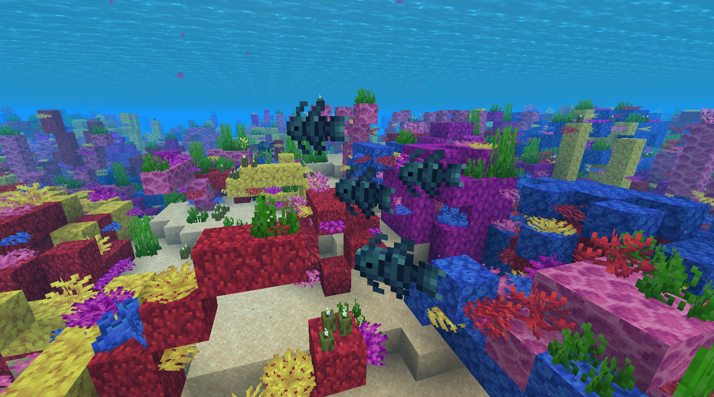

# Welcome to the Tide wiki!

The goal of this mod is to create a more immersive fishing experience by adding new mechanics and fish to the game.

### Contents

On this site, you can find information and documentation about the mod's items, features, configuration, and more!

- [Mechanics and Features](https://lightning-64.github.io/tide-wiki/mechanics/fishing-minigame)
- [Blocks and Items](https://lightning-64.github.io/tide-wiki/items/fishing-rods)
- [Mod Configuration and Datapack Features](https://lightning-64.github.io/tide-wiki/config/mod-config)

### Mod Downloads

* [Curseforge](https://www.curseforge.com/minecraft/mc-mods/tide)
* [Modrinth](https://modrinth.com/mod/tide)

---

---

*Note: This wiki is still under development.*