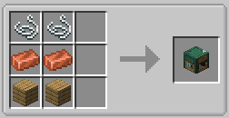

# Angling Table

!!! note
    This page is about the angling table block. For more about rod customization, see [this page](https://lightning-64.github.io/tide-wiki/mechanics/fishing-journal).

The Angling Table (formerly known as the Angler's Workshop pre-1.5) is a block that can be used to customize fishing rods with new accessories.

It can be crafted with two copper ingots, two string, and two wooden planks as shown:

{width=400}