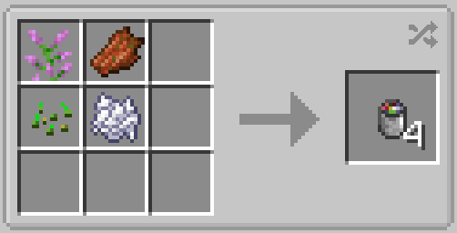

# Bait Items

{width=250}

_Bait, Lucky Bait, and Magnetic Bait, respectively._

### Stats ###
Any item that can be used as bait will say so in it's description:

{width=250}

Each level of fishing speed is equal to one level of the Lure enchantment, and each level of fishing luck is equal to one level of the Luck of the Sea enchantment.

## Bait
Increases fishing speed by 2.

4 Bait can be crafted using one of any flower, one of any seed, one bone meal, and one rotten flesh. Alternatively, it can be found in ocean ruin and shipwreck chests.

## Lucky bait
Increases fishing luck by 2.

16 Lucky bait can be crafted by surrounding a rabbit's foot in 8 regular bait. Alternatively, it can be found in buried treasure and shipwreck chests.

## Magnetic bait
Increases the chance of catching a crate by 25%, and increases fishing speed by 1.

4 Magnetic bait can be crafted using iron nuggets, redstone, lapis, bait, and prismarine crystals in the configuration shown below. Alternatively, it can be found in buried treasure chests.

