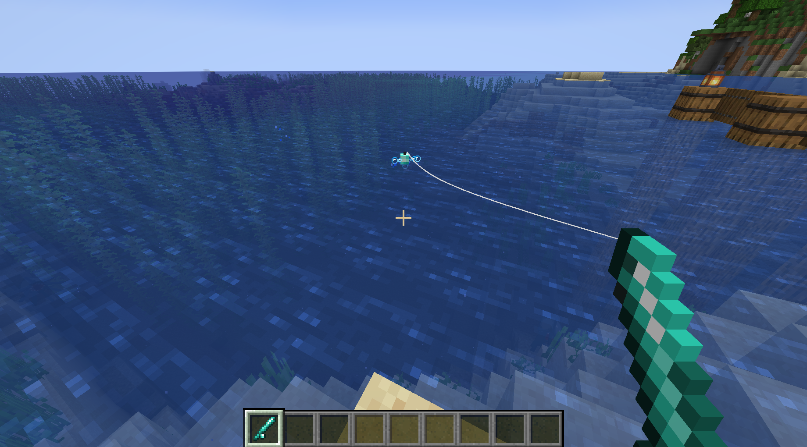
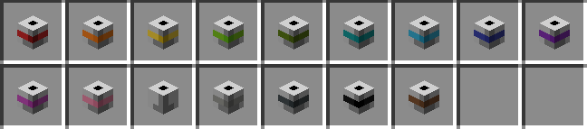
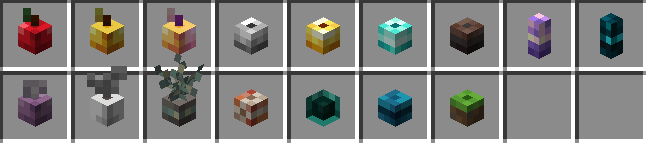

# Fishing Bobbers

Fishing bobber items can be added to a fishing rod in order to change the appearance of the bobber when cast. Bobber changes are purely cosmetic and don't apply any bonuses or special effects.

_A player using a Diamond Fishing Bobber while fishing_

## Colored Bobbers

Colored bobbers are crafted with wooden planks, a slimeball, and any dye.

Their appearance is the same as the default bobber design except for the stripe in the middle, which matches the color of the inputted dye.

## Themed Bobbers

Themed bobbers are crafted the same way as with regular colored bobbers, except they take in a crafting material specific to their theme. For example, the Apple Fishing Bobber (first in the image below) requires wooden planks, a slimeball, and an apple. For a list of crafting materials for each themed bobber, see the list below.

### Materials

_(in order of appearance above)_

- **Apple Fishing Bobber**
  > Material: Apple
- **Golden Apple Fishing Bobber**
  > Material: Apple
- **Enchanted Golden Apple Fishing Bobber**
  > Material: Apple
- **Iron Fishing Bobber**
  > Material: Iron Ingot
- **Golden Fishing Bobber**
  > Material: Golden Ingot
- **Diamond Fishing Bobber**
  > Material: Diamond
- **Netherite Fishing Bobber**
  > Material: Netherite Ingot
- **Amethyst Fishing Bobber**
  > Material: Amethyst Shard
- **Echo Fishing Bobber**
  > Material: Echo Shard
- **Chorus Fishing Bobber**
  > Material: Chorus Fruit
- **Feather Fishing Bobber**
  > Material: Feather
- **Lichen Fishing Bobber**
  > Material: Glow Lichen
- **Nautilus Fishing Bobber**
  > Material: Nautilus Shell
- **Pearl Fishing Bobber**
  > Material: Ender Pearl
- **Heart Fishing Bobber**
  > Material: Heart of the Sea
- **Grassy Fishing Bobber**
  > Material: Grass Block