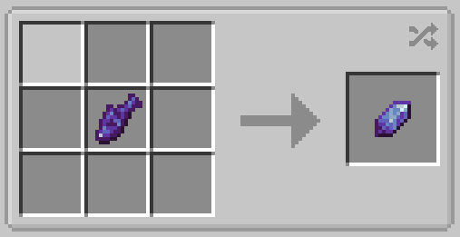

# Deep Aqua Crystal

The deep aqua crystal is an item crafted from a Crystalline Carp. It's only practical purpose is for creating a deep aqua arrow.

# Deep Aqua Arrow

Deep aqua arrows can be crafted by surrounding 8 regular arrows in one deep aqua crystal.

They are unique in that they always fly in a perfectly straight line, on the surface or underwater. Their best use is underwater where regular arrows don't fly well, but they can be used anywhere you want.

