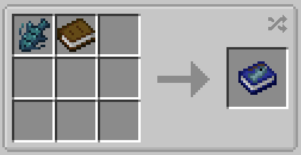

# Fishing Journal

!!! note
    This page is about the fishing journal item. For more about the menu itself, see [this page](https://lightning-64.github.io/tide-wiki/mechanics/fishing-journal).

The Fishing Journal is an item used to view the player's fishing journal progress in a world. One fishing journal will be given to new players upon starting a world, unless the [`giveJournal`](https://lightning-64.github.io/tide-wiki/config/mod-config/give-journal) config setting is set to false.

Alternatively, the fishing journal can be crafted by using one book and one of any fish.

