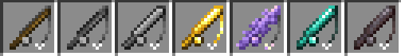
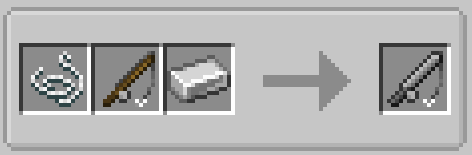

# Fishing Rods

There are currently 6 types of fishing rods added by Tide, as well as the basic fishing rod.

## Crafting

Fishing rods can be crafted at a smithing table with a piece of string, the rod's crafting material (see the list below), and a lower-tier fishing rod.

## Types

### Stone fishing rod
> * Default durability: 32
> * Crafting material: Any cobblestone block

### Iron fishing rod
> * Default durability: 64
> * Crafting material: Iron ingot

### Gold fishing rod
> * Default durability: 32
> * Crafting material: Gold ingot

### Crystal fishing rod
> * Default durability: 80
> * Crafting material: Amethyst shard

### Diamond fishing rod
> * Default durability: 128
> * Crafting material: Diamond

### Netherite fishing rod
> * Default durability: 512
> * Crafting material: Netherite ingot
> * Item is fireproof

---