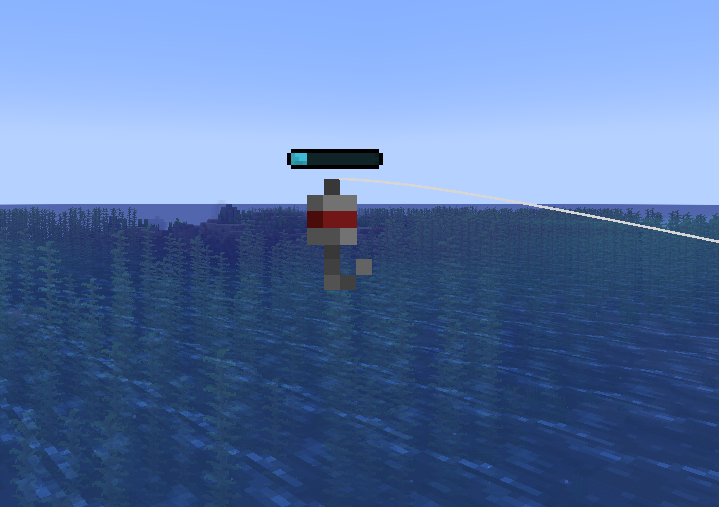
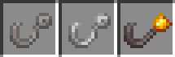
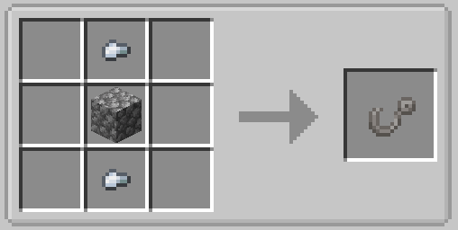
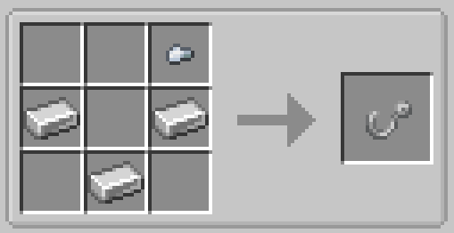
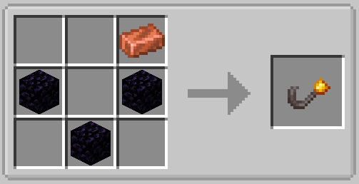

# Fishing Hooks

Fishing hook items can be added to a fishing rod in order to apply certain bonuses, along with visually changing the look of the hook entity.

_A player casting the bobber with an iron fishing hook_

## Types

There are currently 3 types of hooks: the default Fishing Hook, Iron Fishing Hook, and Lavaproof Fishing Hook.

### Fishing Hook

The fishing hook is the default fishing hook that is used. Applying it to a rod won't apply any visual or special effects.

### Iron Fishing Hook

When applied, the iron fishing hook will reduce the speed of the fishing minigame by 11%.

### Lavaproof Fishing Hook

When applied, the lavaproof fishing hook will allow the player to fish in lava. The bobber will no longer sink to the bottom of lava pools when cast, and items from lava loot tables can be caught. This item is pretty useful.

