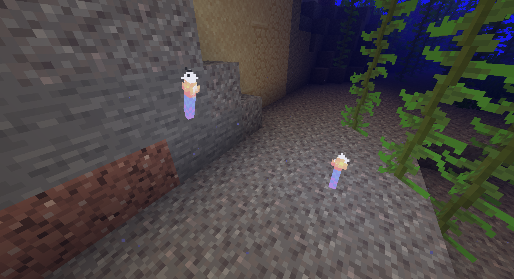

# Jelly Torch

8 Jelly torches can be crafted from one Luminescent Jellyfish.

They function similarly to regular torches, except they can be placed underwater and waterlogged. Their brightness is always the same as regular torches, no matter where they are placed.

