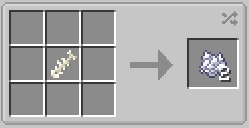
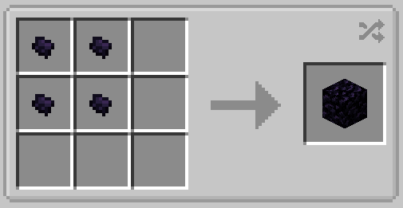

# Junk Items

## Fish Bone

Fish bones are junk items that can be found randomly when fishing with low luck.

Their only practical use is to be turned into bone meal:

## Obsidian Fragment

Fish bones are junk items that can be found randomly when lava fishing with low luck.

Their only practical use is to be turned into obsidian:

