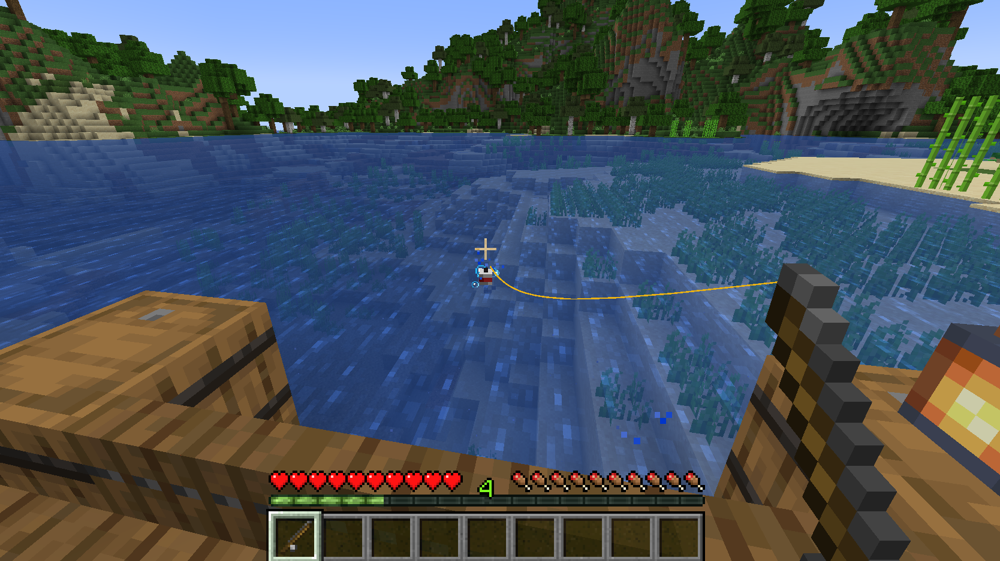
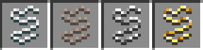
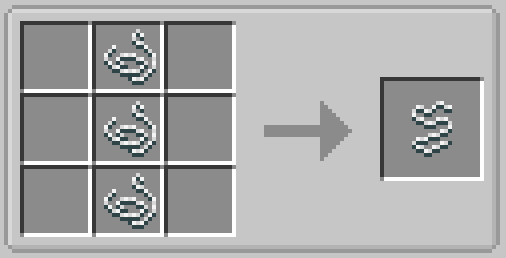
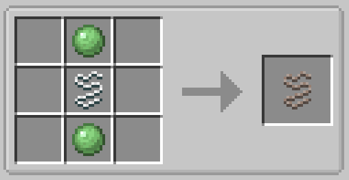
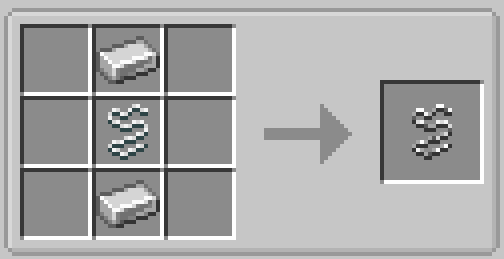
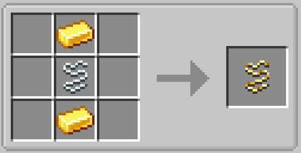

# Fishing Lines

Fishing line items can be added to a fishing rod in order to apply certain bonuses, along with visually changing the color of the string connecting the bobber and the fishing rod.

_A player fishing with golden line applied_

## Types

There are currently 4 types of lines: the default Fishing Line, Braided Fishing Line, Reinforced Fishing Line, and Golden Fishing Line.

### Fishing Line

The fishing line is the default fishing line that is used. Applying it to a rod won't apply any visual or special effects.

### Braided Fishing Line

When applied, the braided line will increase the speed at which you can charge the fishing rod while casting by 67%.

### Reinforced Fishing Line

When applied, the reinforced line will provide a 30% chance of not consuming durability when fishing.

!!! bug
    Currently this is broken: the normal fishing line will provide the 30% durability chance instead of the reinforced line. This will be fixed in a future update to the mod.

### Golden Fishing Line

When applied, the golden line will increase fishing luck by 1, equivalent to one level of the Luck of the Sea enchantment.

!!! tip
    The golden line is one of the components necessary for catching the **Midas Fish**!