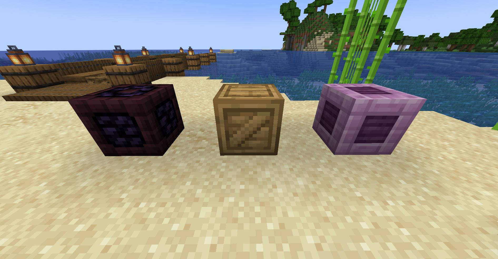
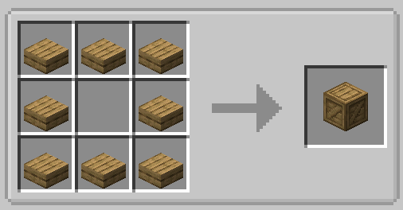

# Loot Crates

Loot crates are blocks that can be randomly pulled from the water when fishing in lava or open water. When fished, they contain loot that changes dynamically depending on where they are pulled from.



## Rarity

In order to catch a crate, the player must be fishing either in open water (meaning there's no blocks besides water near the bobber) or anywhere in lava. After that, crate chance varies depending on the player's luck. Having a higher fishing luck will increase the chances of catching a crate.

!!! tip
    You can increase the chance of catching a crate while fishing to 25% by fishing with [magnetic bait](https://lightning-64.github.io/tide-wiki/items/bait-items/#magnetic-bait) equipped!

Here's a simplified version of minecraft's fishing loot table, including Tide's crate chances.

```json
"entries": [

    // Minecraft's default fishing loot
    {
        "name": "minecraft:gameplay/fishing/fish",
        "quality": -1,
        "weight": 85
    },
    {
        "name": "minecraft:gameplay/fishing/junk",
        "quality": -2,
        "weight": 10
    },
    {
        "name": "minecraft:gameplay/fishing/treasure",
        "quality": 2,
        "weight": 5
    },

    // Tide's crate loot
    {
        "name": "tide:gameplay/fishing/crates/block",
        "quality": 1,
        "weight": 6
    }
]
```

## Types

### Wooden Crate

The wooden crate can be pulled from water in dimensions besides the nether and the end. They are unique among crates in that they can also be crafted from 8 wooden slabs, but obviously won't come with loot when you craft them.



!!! note
    If the mod can't determine the correct crate to be pulled for whatever reason, it will default to the surface loot crate with freshwater loot.

#### Loot

**_Freshwater_**

- Salmon
- Trout
- Stick
- Cobblestone
- Iron Nugget
- Bass
- Wheat
- Wheat Seeds
- Sand
- Enchanted Book (with random enchantments)

**_Saltwater_**

- Salmon
- Trout
- Tuna
- Iron Nugget
- Gold Nugget
- Iron Ingot
- Gold Ingot
- Emerald
- Fishing Rod (with random durability and enchantments)
- Enchanted Book (with random enchantments)
- Written Book (with legendary fish hints)

**_Underground (stone layer)_**

- Stick
- Iron Nugget
- Cobblestone
- Andesite
- Gold Ingot
- Lapis Lazuli
- Stone Pickaxe (with random durability and enchantments)
- Enchanted Book (with random enchantments)

**_Deep Underground (deepslate layer)_**

- Iron Nugget
- Raw Copper
- Raw Iron
- Gold Ingot
- Lapis Lazuli
- Redstone
- Amethyst Shard
- Emerald
- Diamond
- Iron Pickaxe (with random durability and enchantments)
- Enchanted Book (with random enchantments)

### Obsidian Crate

The obsidian crate can be pulled from lava while lava fishing in any dimension besides the end.

#### Loot

**_Overworld Lava (surface)_**

- Gold Nugget
- Flint
- Bone
- Obsidian
- Obsidian Fragment
- Magma Block
- Enchanted Book (with random enchantments)

**_Overworld Lava (underground)_**

- Coal
- Bone
- Crying Obsidian
- Obsidian Fragment
- Magma Block
- Diamond
- Enchanted Book (with random enchantments)

**_Overworld Lava (deep underground)_**

- Iron Ingot
- Bone
- Obsidian
- Crying Obsidain
- Copper Ingot
- Gold Ingot
- Diamond
- Enchanted Book (with random enchantments)

**_The Nether_**

- Magma Mackerel
- Ashen Perch
- Nether Brick
- Nether Wart
- Blaze Powder
- Magma Cream
- Gold Ingot
- Gold Block
- Netherite Scrap
- Enchanted Book (with random enchantments)

### End Crate

The end crate can be pulled from water or lava while fishing in the end.

!!! note
    You still need to be fishing in open water to catch crates, even in the end. You may have to construct a large enough pool of water before finding these.

#### Loot

**_The End_**

- Ender Pearl
- Chorus Fruit
- Popped Chorus Fruit
- Shulker Shell
- Elytra

**_The End (lava)_**

- Ender Pearl
- Chorus Fruit
- Popped Chorus Fruit
- Shulker Shell
- Elytra

!!! tip
    Lava fishing in the end will grant you a slightly higher chance of rare loot! Good luck bringing enough lava over though.