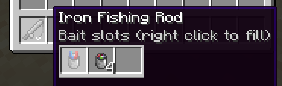

# The Bait System

Bait can be held along with a fishing rod while fishing to increase speed and provide other fishing buffs depending on what bait you use.

## Usage

To use bait, drag the bait item over to the fishing rod in the inventory view and right click to fill an avaliable bait slot. The farthest left bait will be used.

---

## Types of bait

There are currently 3 types of bait items in the mod: **_Bait_**, **_Lucky Bait_**, and **_Magnetic Bait_**, shown above respectively. Additionally, torchflowers and pitcher pods can also be used as bait. Some mods may also have their own items that can act as bait (ex. worms from the Fish of Thieves mod)

You can see the stats of the bait items [here](https://lightning-64.github.io/tide-wiki/items/bait-items).