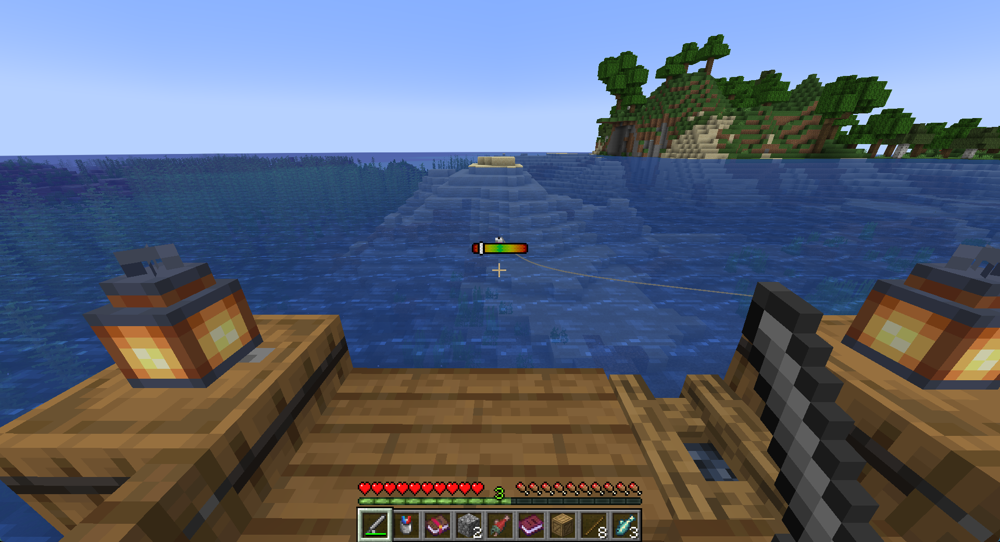
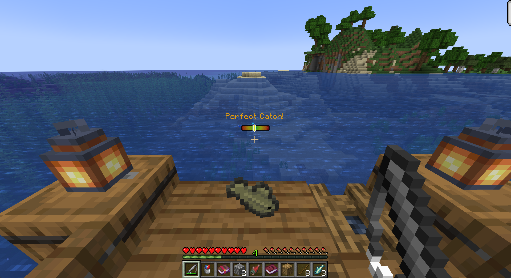

# Fishing Minigame

### Activation

The minigame activates whenever a fish is caught, meaning after you right-click with a fishing rod to actually reel in the fish. Once activated, a colored bar will appear above the crosshair, as seen below.

The goal is to try and get the vertical white bar to be as close to the center of the minigame GUI as possible, in the light green section.

_A player playing the minigame_

---

### Rating system

Depending how close the vertical bar is to the center, the minigame will have different results:

* **Perfect** - Achieved by clicking within the inner **_10%_** of the bar. This means a few things:
> * The catch rate will be 100%, meaning you will always successfully catch the fish.
> * The text will display in the `gold` color
* **Great** - Achieved by clicking within the inner **_15%_** of the bar.
> * The catch rate will be 100%, meaning you will always successfully catch the fish.
> * The text will display in the `light green` color
* **Good** - Achieved by clicking within the inner **_30%_** of the bar.
> * The catch rate will be 95%, meaning you will successfully catch the fish most of the time.
> * The text will display in the `green` color
* **Ok** - Achieved by clicking within the inner **_45%_** of the bar.
> * The catch rate will be 50%, meaning you will only catch the fish half of the time.
> * The text will display in the `yellow` color
* **Bad** - Achieved by clicking within the inner **_60%_** of the bar.
> * The catch rate will be 40%, meaning you will rarely catch the fish.
> * The text will display in the `red` color
* **Terrible** - Achieved by clicking within the inner **_78%_** of the bar.
> * The catch rate will be 10%, meaning you will usually never catch the fish.
> * The text will display in the `dark red` color
* **Trash** - Clicking anywhere else in the GUI will give you this rating.
> * The catch rate will be 0%, meaning you won't ever be able to catch a fish.
> * The text will display in the `black` color
> * Achieving this rating also means you might need to get better.

_A player getting the "perfect" rating in the minigame_

---
