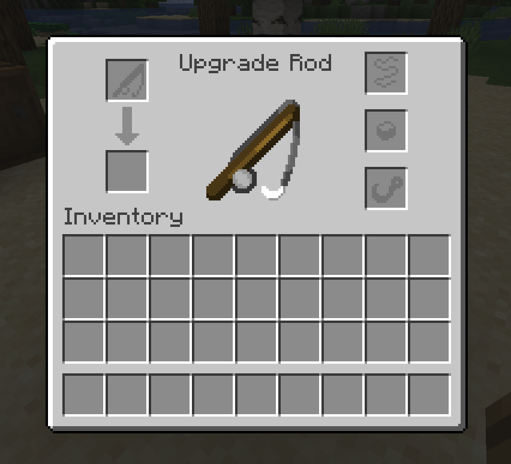
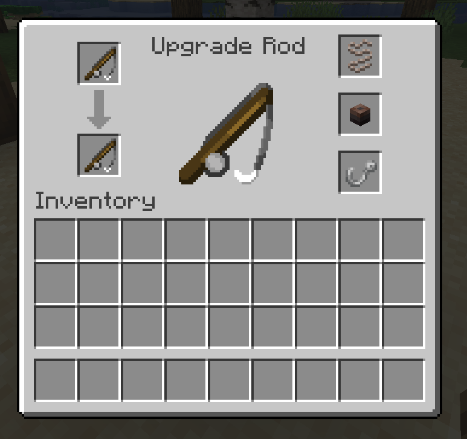
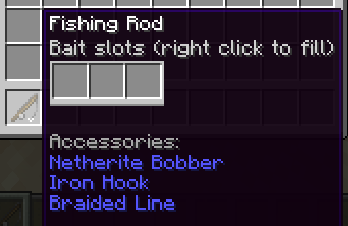

# Fishing Rod Customization

Fishing rods can be customized by adding [bobbers](https://lightning-64.github.io/tide-wiki/items/bobbers), [hooks](https://lightning-64.github.io/tide-wiki/items/hooks), and [lines](https://lightning-64.github.io/tide-wiki/items/lines) to them at the [Angling Table](https://lightning-64.github.io/tide-wiki/items/angling-table).

## GUI Layout

When a player right-clicks on an Angling Table, the rod customization GUI will appear. The GUI has two slots on the left for fishing rod input/output, and three slots on the right for inputting rod accessories.

The top right slot is for lines, the center right slot is for bobbers, and the bottom right slot is for hooks. The slots will accept any items that have the correct tag corresponding to the slot (ex. `tide:bobbers` for the bobber slot).

## Usage

To add accessories to a fishing rod, place the fishing rod item in the top left slot of the menu. Then, place any accessories in their corresponding slots on the right side. Only 1 of the 3 right-side slots have to be filled in order to complete the upgrade.

After upgrading a rod, its accessories will be displayed in the tooltip.

Once you've put in the accessories you want, grab your new fishing rod from the output slot (on the bottom left of the menu). The accessories will be applied to the fishing rod and the menu will be cleared of its items.

Putting a rod back in the input slot will return all of its accessories to the menu for modification. To take an accessory off a fishing rod, put the rod in the top left slot as usual and take back the accessories you want from the right side. Then, take the output rod from the bottom left. If you want to remove all accessories, take all accessories back from the right side along with the input rod on the top left.

!!! tip
    A quick way to remove all accessories from a rod is to put the input rod in the top slot and close the menu. The input rod and any accessories in the menu will be automatically returned to your inventory.